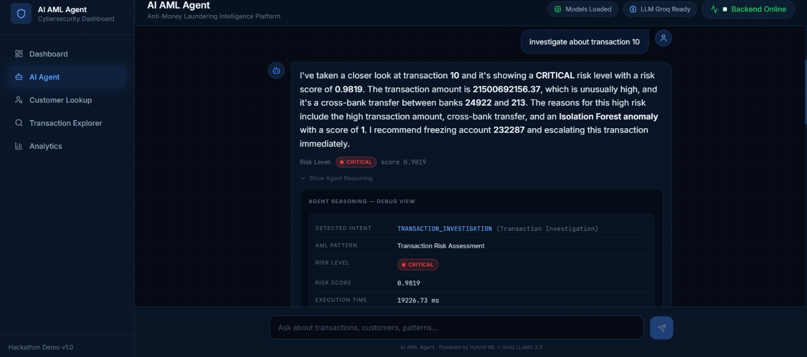
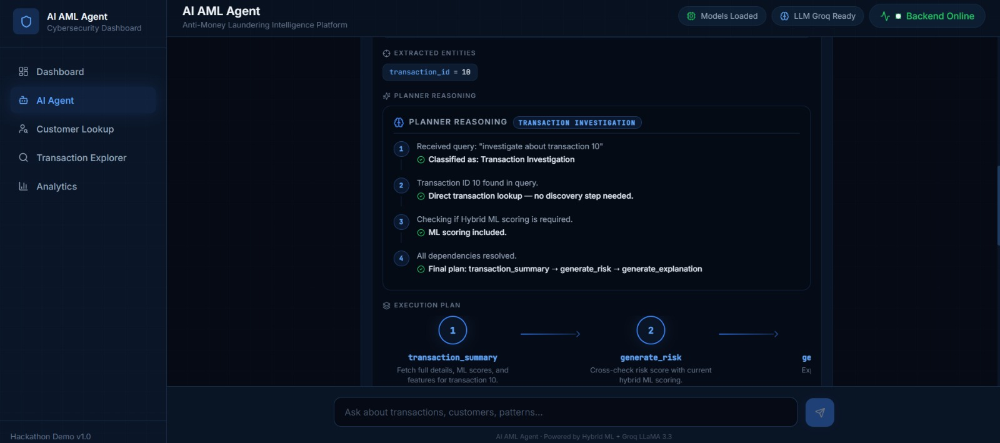
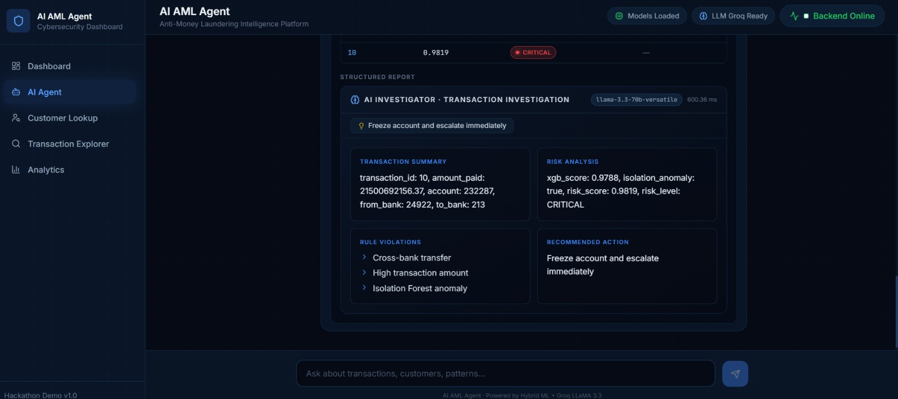
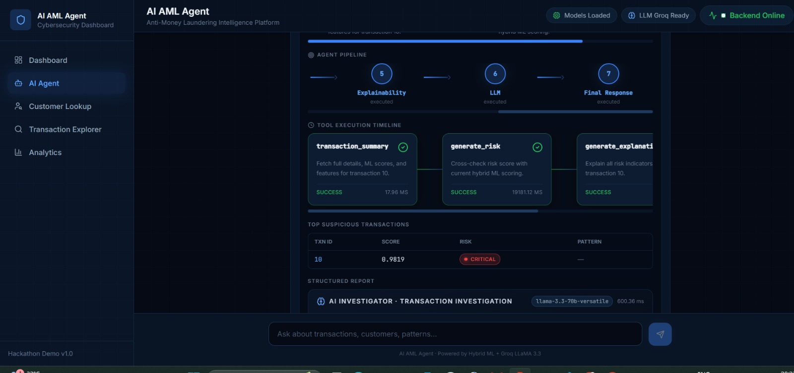
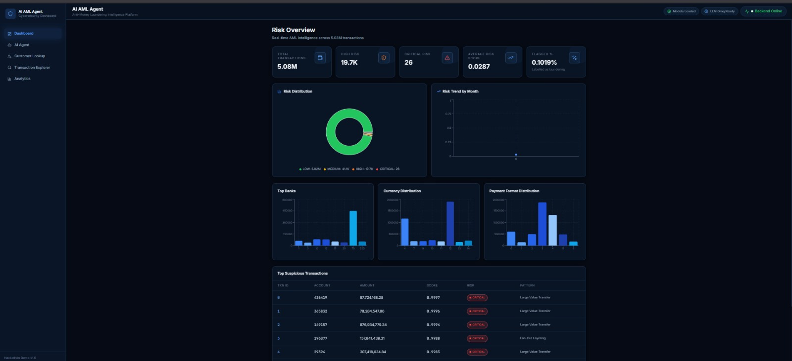
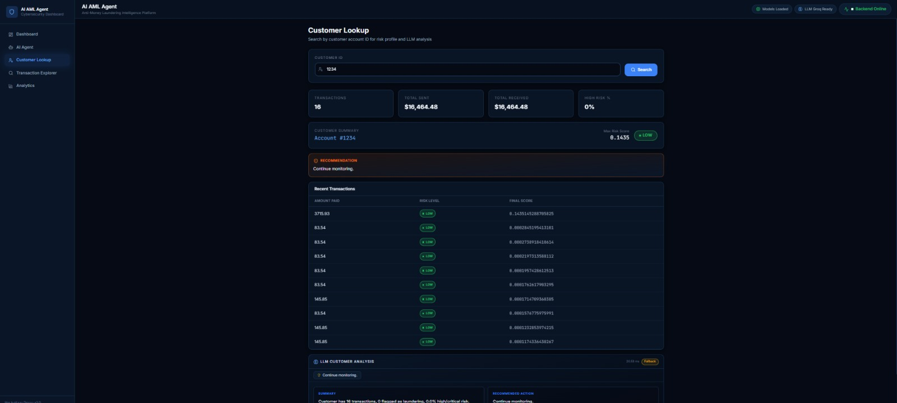
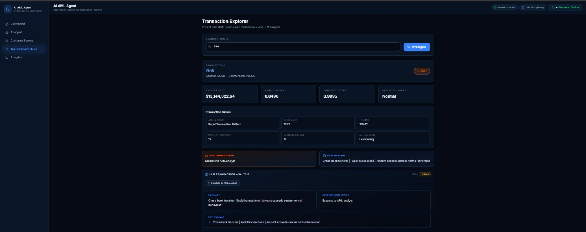
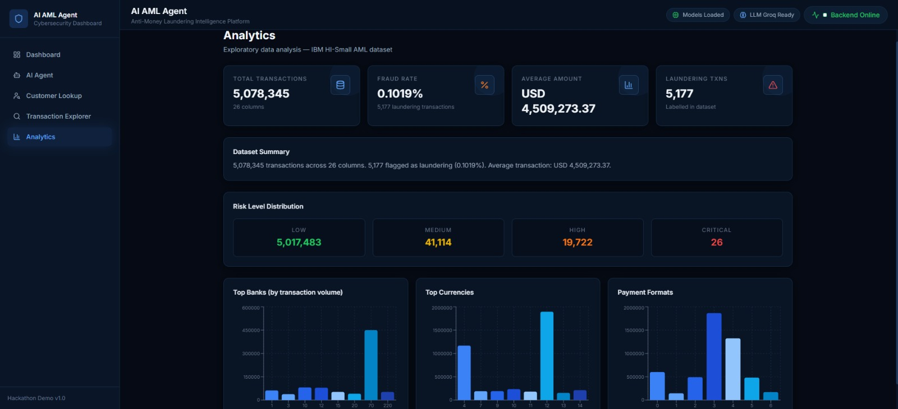

# 🛡️ AI-Powered AML Agent

An autonomous, AI-powered Anti-Money Laundering (AML) detection and investigation system. Type a question in plain English — *"Which bank has the highest suspicious transactions?"* or *"Investigate customer 436419"* — and the agent parses your intent, builds a query-specific execution plan, runs the right analysis, computes risk scores using hybrid ML, and returns a concise, evidence-backed answer.

No fixed pipeline. No fabricated numbers. Every decision is inspectable.

---

## Table of Contents

- [Problem Statement](#problem-statement)
- [What This Project Does](#what-this-project-does)
- [Screenshots](#screenshots)
- [Tech Stack](#tech-stack)
- [Dataset](#dataset)
- [Machine Learning Pipeline](#machine-learning-pipeline)
- [Hybrid Risk Engine](#hybrid-risk-engine)
- [Backend Architecture](#backend-architecture)
- [Frontend Architecture](#frontend-architecture)
- [Data Flow — A Single Query, End to End](#data-flow--a-single-query-end-to-end)
- [Performance](#performance)
- [Project Structure](#project-structure)
- [Getting Started](#getting-started)
- [Environment Variables](#environment-variables)
- [API Reference](#api-reference)
- [What Makes This Project Different](#what-makes-this-project-different)
- [License](#license)

---

## Problem Statement

Financial institutions are mandated by regulatory bodies (FinCEN, FATF, and local authorities) to run robust Anti-Money Laundering compliance programs. In practice:

- **Rule-based systems generate excessive false positives**, overwhelming compliance teams and driving up operational cost.
- **Sophisticated laundering techniques** — structuring, smurfing, layering — routinely evade conventional, static detection methods.
- **Manually reviewing millions of transactions is impossible.**

The challenge this project solves: build an intelligent, autonomous agent that learns from transaction patterns, identifies suspicious behavior, and returns explainable risk assessments with actionable escalation recommendations — reducing false positives and letting compliance teams focus on genuine threats instead of manually tuning rules.

Critically, the agent must **not** follow a fixed sequential pipeline. It parses each query's intent, filters, entities, and target pattern, then **dynamically constructs an execution plan**, invoking only the tools that specific query needs.

| User Query | Expected Agent Behaviour |
|---|---|
| *"Find structuring patterns in the last 30 days"* | Applies the time filter first; invokes only structuring-focused features and anomaly detection — skips full EDA |
| *"Which customers made 10+ transactions under $10,000?"* | Runs the aggregation and threshold rule directly; ML anomaly detection is not required |
| *"Is customer ID 4521 suspicious?"* | Performs a single-entity lookup; explains existing flags or computes risk on-demand for that customer only |

---

## What This Project Does

This is a full-stack system with three major parts:

1. **A machine learning pipeline** that engineers 35 AML-relevant features and trains a hybrid supervised + unsupervised risk model on 5M+ transactions.
2. **A FastAPI backend** that acts as the agent's brain — a `Planner → Router → Tools → Hybrid ML → LLM` pipeline that classifies intent, resolves missing entities, executes only the necessary tools, and summarizes results without ever inventing facts.
3. **A React frontend** with a ChatGPT-style investigation console, a dashboard, and dedicated customer/transaction/analytics views — all with a transparent "Show Agent Reasoning" debug panel.

Core capabilities:

- Scores every transaction with a hybrid ML model (XGBoost + Isolation Forest)
- Flags suspicious patterns using deterministic rules (structuring, rapid transactions, threshold evasion, etc.)
- Lets investigators query the data in plain English across 11 distinct intents
- Resolves missing details automatically (e.g., "highest-risk customer" → discovers the ID itself)
- Maintains conversation context so follow-up questions work without repeating IDs
- Generates professional, structured investigation reports — and is explicitly honest when nothing suspicious is found

---

## Screenshots

## AI Agent









## Dashboard



## Customer Lookup



## Transaction Explorer



## Analytics



---

## Tech Stack

**Machine Learning**
- Python, pandas, scikit-learn
- XGBoost (supervised gradient boosting)
- Isolation Forest (unsupervised anomaly detection)

**Backend**
- FastAPI (Python)
- Groq API — LLaMA 3.3 70B Versatile (LLM summarization layer)
- pandas / numpy for in-memory analytics

**Frontend**
- React 18 + TypeScript
- Vite
- Tailwind CSS
- Framer Motion
- Recharts
- Axios

---

## Dataset

**Source:** IBM HI-Small AML Dataset (publicly available)

| Metric | Value |
|---|---|
| Total transactions | 5,078,345 |
| Raw columns | 25+ |
| Engineered features | 35 |
| Laundering transactions | ~5,173 (≈ 0.10%) |

**Raw columns include:** Timestamp, From Bank, Account (sender), To Bank, Account.1 (receiver), Amount Paid, Amount Received, Payment Currency, Receiving Currency, Payment Format (wire, credit card, cash, cheque, etc.), and `Is Laundering` (target label).

---

## Machine Learning Pipeline

The pipeline runs through numbered scripts, from raw data to pre-scored risk predictions.

### Script 02 — Feature Engineering (35 features, 5 categories)

| Category | Features |
|---|---|
| **Temporal** | Hour, Day, Month, Weekday, Weekend |
| **Amount** | Log_Amount, Amount_Diff, Amount_Ratio, Sender_Avg, Receiver_Avg, Sender_Deviation, Receiver_Deviation, High_Value, Near_Threshold |
| **Behaviour** | Sender_Tx_Count, Receiver_Tx_Count, Unique_Receivers, Unique_Senders, Minutes_Since_Last, Rapid_5m/10m/30m, Daily_Sent_Amount, Daily_Tx_Count |
| **Bank** | Cross_Bank, Currency_Change |
| **Encoding** | Label-encoded From Bank, To Bank, Payment Currency, Payment Format, Account, Account.1 |

Key AML signals: `Sender_Deviation` (behavioral drift), `Near_Threshold` (structuring detection, $9k–$10k), `Unique_Receivers` (fan-out detection), and `Rapid_5m/10m/30m` (rapid successive transfers).

### Script 03 — XGBoost Training

Binary classifier predicting `P(transaction = money laundering)`. Chosen for its handling of class imbalance, feature importance output, and calibrated probabilities. Saved to `models/xgb_model.pkl`.

### Script 04 — Isolation Forest Training

Unsupervised anomaly detector trained on the same features, without labels — anomalous transactions require fewer random splits to isolate. Complements XGBoost by catching patterns absent from labelled data. Saved to `models/isolation_forest.pkl`.

### Script 05 — Hybrid Risk Engine

Combines both model outputs into a single score (see [Hybrid Risk Engine](#hybrid-risk-engine) below) and pre-computes it for all 5 million transactions, saved to `data/risk_predictions.csv`. Live queries never re-run inference — they look up pre-computed scores.

**Saved outputs:**

```
models/xgb_model.pkl          # XGBoost model
models/isolation_forest.pkl   # Isolation Forest model
models/label_encoders.pkl     # LabelEncoder objects
data/features.csv             # 35-feature matrix
data/risk_predictions.csv     # Pre-scored transactions with risk levels
```

---

## Hybrid Risk Engine

```
Final Risk Score = 0.85 × XGBoost_probability + 0.15 × Isolation_Forest_flag
```

The 85/15 weighting reflects that the supervised XGBoost signal is more reliable, while the unsupervised anomaly detector adds coverage for previously unseen patterns.

| Risk Level | Score Range | Action Triggered |
|---|---|---|
| 🔴 **CRITICAL** | ≥ 0.90 | Freeze account immediately |
| 🟠 **HIGH** | 0.75 – 0.90 | Escalate to AML analyst |
| 🟡 **MEDIUM** | 0.50 – 0.75 | Manual review required |
| 🟢 **LOW** | < 0.50 | Continue monitoring |

---

## Backend Architecture

The backend is structured around an agentic pipeline: **Planner → Router → Tools → Hybrid ML → LLM.**

### `backend/loader.py` — Startup Resource Manager

Loads every model, encoder, and dataframe once at startup and holds them as module-level singletons.

- **EDA Cache** — all dataset statistics pre-computed once (fraud %, average amounts, top banks/currencies/payment formats, risk distribution). Subsequent EDA queries return in **< 1 ms**.
- **Customer Index** — `groupby("Account").indices` builds an O(1) account → row-position map, so any customer lookup uses `df.iloc[positions]` instead of scanning 5M rows.
- Accessor functions: `get_xgb_model()`, `get_isolation_forest()`, `get_features_df()`, `get_risk_predictions_df()`, `get_eda_cache()`, `get_customer_df(customer_id)`.

### `backend/tools.py` — Analytical Tools

All data-processing functions the agent can call. No ML inference happens at query time except in edge cases — everything uses pre-computed scores.

| Tool | Purpose |
|---|---|
| `run_eda(filters)` | Dataset statistics — instant from cache, or recomputed on a filtered subset |
| `customer_summary(customer_id)` | O(1) customer profile: tx count, totals, max risk, risk level, top reasons, recent transactions |
| `transaction_summary(transaction_id)` | Full transaction lookup with ML scores, anomaly flag, AML pattern, reasons |
| `generate_risk(filters)` | Top-N transactions by Final Risk Score, using the customer index when scoped |
| `generate_explanation(...)` | Human-readable reasons from feature flags ("Cross-bank transfer", "Near reporting threshold", etc.) |
| `top_suspicious_transactions(n, filters)` | Pre-sorted top-N by risk score |
| `rule_engine(rules)` | Pure-pandas deterministic rules: rapid transactions, near-threshold, structuring, daily volume |
| `filter_data(filters)` | Row count + column list for a filtered subset |
| `get_dashboard_stats(filters)` | Aggregated dashboard metrics (risk distribution, top banks/currencies, monthly trend) |
| `analytics_tool(group_by, metric, top_n, filters)` | Ranked group-by analytics with a headline finding, e.g. *"Bank 70 has highest suspicious transactions: 1,247"* |
| `investigation_tool(customer_id, transaction_id, bank_id)` | Unified entry point delegating to customer/transaction/bank analysis |
| `pattern_detection_tool(pattern_type, top_n, filters)` | Finds transactions matching structuring, near-threshold, rapid, cross-bank, currency-change, high-value, anomaly, or fan-out patterns |
| `comparison_tool(entity_type, entity_ids, top_n)` | Side-by-side comparison of banks, currencies, formats, or customers |
| `knowledge_tool(topic)` | Static factual answers about the system itself (never runs ML) |

### `backend/planner.py` — Intent Classifier & Plan Builder

The first stage of every query.

- **Intent detection** classifies queries into **11 intents**: `DATASET_EXPLORATION`, `KNOWLEDGE`, `ANALYTICS_QUERY`, `COMPARISON`, `CUSTOMER_INVESTIGATION`, `TRANSACTION_INVESTIGATION`, `PATTERN_DETECTION`, `TOP_SUSPICIOUS`, `MODEL_ANALYTICS`, `RISK_EXPLANATION`, `GENERAL`.
- **Entity extraction** pulls `customer_id`, `transaction_id`, `bank_id`, `entity_ids`, `top_n`, `group_by`, `metric`, `knowledge_topic`, amounts, and date ranges directly from the query text.
- **Dependency resolution** — the planner's key intelligent behaviour: if an investigation intent is detected without an entity, it prepends a discovery step (e.g. `top_suspicious_transactions`) so *"Show me the highest-risk customer"* works with no ID at all.
- **Reasoning thoughts** — every plan includes human-readable justifications for each decision, surfaced in the frontend's debug panel.

### `backend/router.py` — Execution Dispatcher

- **Dynamic parameter resolution** — injects a discovered ID from a prior tool call into the next tool's context.
- **Context propagation** — a single context dictionary carries resolved entities across the whole tool chain.
- **Conversation history** — resolves pronouns and implicit references ("this customer", "that transaction", "it") using the last 6 turns before planning.
- Builds a full **execution summary**: intent, entities, reasoning, tool timings, and LLM availability.

### `backend/llm.py` — Groq LLM Integration

The LLM's only job is to **summarize** what the tools returned — never to predict, score, or invent statistics.

- **Model:** Groq LLaMA 3.3 70B Versatile (~1–2 sec inference)
- `generate_investigation_report(context)` — structured JSON report; schema differs per intent
- `generate_natural_response(context, report)` — a 2–5 sentence plain-English answer, what the user sees in chat

**Anti-hallucination enforcement:**
- Temperature `0.1`
- Prompts include only real tool output — nothing else
- System prompt: *"Only state values that appear explicitly in the TOOL DATA block"*
- If `is_suspicious=False`, the prompt hard-instructs: *"Do NOT say the customer was flagged"*
- `_apply_schema()` strips any field not defined for the current intent
- Rule-based fallback responses are used if the LLM is unavailable

### `backend/app.py` — FastAPI Application

| Endpoint | Description |
|---|---|
| `GET /health` | Status, `models_loaded`, `llm_available` |
| `GET /dashboard` | All dashboard metrics |
| `GET /eda` | EDA statistics |
| `GET /top_suspicious?n=20` | Top-N suspicious transactions |
| `GET /customer/{customer_id}` | Customer profile + LLM analysis |
| `GET /transaction/{transaction_id}` | Transaction details + LLM analysis |
| `POST /predict` | Score a single transaction from raw features |
| `POST /rule_engine` | Apply deterministic AML rules |
| `POST /query` | Main agent endpoint — natural language + conversation history |
| `GET /sample/{index}` | Sample transaction for testing |

Startup takes ~60–90 seconds (loads 5M rows, builds all indexes); every request after that is fast. CORS is configured for `localhost:5173` (Vite dev server).

---

## Frontend Architecture

Built with React 18, TypeScript, Vite, Tailwind CSS, Framer Motion, and Recharts, in a dark cybersecurity theme.

| Page | Route | Description |
|---|---|---|
| **Dashboard** | `/` | 5 stat cards, risk distribution pie chart, risk trend line chart, top banks/currencies/formats bar charts, top suspicious transaction table |
| **AI Agent** | `/agent` | ChatGPT-style investigation console with conversation memory and a collapsible "Show Agent Reasoning" debug panel |
| **Customer Lookup** | `/customer` | Search by account ID → profile cards, risk badge, recommendation, recent transactions, LLM analysis |
| **Transaction Explorer** | `/transaction` | Search by transaction ID → ML scores, metadata, explanation card, recommendation, LLM analysis |
| **Analytics** | `/analytics` | Dataset stat cards, risk-level distribution, top banks/currencies/formats charts |

**Key components:** `AMLAnswer`, `AgentDebugPanel`, `LLMReportCard`, `PlannerReasoning`, `PipelineTimeline`, `ToolExecutionTimeline`, `RiskBadge`, `ConfidenceMeter`.

All backend calls go through a single Axios instance (`api.ts`), proxied via Vite (`/api → http://127.0.0.1:8000`) to avoid CORS issues in development.

---

## Data Flow — A Single Query, End to End

Example: **"Investigate customer 436419"**

1. Frontend sends `POST /api/query` with the query text + conversation history.
2. `router.py` resolves pronouns — none found here, query unchanged.
3. `planner.py` detects `CUSTOMER_INVESTIGATION`, extracts `customer_id = 436419`, and builds the plan: `[customer_summary, generate_risk, generate_explanation]` — no discovery step needed since the ID is present.
4. `router.py` executes the plan:
   - `customer_summary(436419)` → O(1) lookup, 40 rows, ~50 ms
   - `generate_risk({customer_id: 436419})` → `nlargest(20)`, ~25 ms
   - `generate_explanation(...)` → builds the reasons list
5. `llm.py` is called twice:
   - `generate_investigation_report()` → structured JSON (customer summary, risk score, why flagged, recommended action)
   - `generate_natural_response()` → a 2–4 sentence conversational answer
6. The router assembles the final response with `natural_response`, `investigation_report`, `execution_summary`, and resolved entities.
7. The frontend renders `natural_response` as markdown, shows a risk badge, and offers the "Show Agent Reasoning" toggle.

**Total time: ~5–8 seconds**, dominated by the two LLM calls.

---

## Performance

| Operation | Time | Why It's Fast |
|---|---|---|
| EDA query | < 1 ms | Pre-computed at startup |
| Customer lookup | ~50 ms | O(1) index, `iloc` on ~40 rows |
| Risk scoring (customer) | ~25 ms | Pre-computed, just `nlargest` |
| Full customer query (no LLM) | ~150 ms | Index + pandas ops only |
| LLM investigation report | ~1–2 sec | Groq inference |
| LLM natural response | ~0.5–1 sec | Short output, Groq inference |
| **Full end-to-end** | **~5–8 sec** | Dominated by 2 LLM calls |
| Backend startup | ~60–90 sec | Loading 5M rows + building indexes |

---

## Project Structure

```
aml-agent/
├── backend/
│   ├── app.py              # FastAPI application & endpoints
│   ├── loader.py            # Startup resource manager (models, caches, indexes)
│   ├── planner.py           # Intent classification & execution plan builder
│   ├── router.py            # Tool dispatch, context propagation, conversation resolution
│   ├── tools.py              # All analytical tools (EDA, risk, rules, patterns, comparisons)
│   └── llm.py               # Groq LLM integration & anti-hallucination logic
├── frontend/
│   ├── src/
│   │   ├── pages/            # Dashboard, AI Agent, Customer Lookup, Transaction Explorer, Analytics
│   │   ├── components/       # AMLAnswer, AgentDebugPanel, LLMReportCard, RiskBadge, etc.
│   │   └── services/
│   │       └── api.ts        # Axios instance for backend communication
│   └── vite.config.ts
├── models/
│   ├── xgb_model.pkl
│   ├── isolation_forest.pkl
│   └── label_encoders.pkl
├── data/
│   ├── features.csv
│   └── risk_predictions.csv
├── scripts/
│   ├── 02_feature_engineering.py
│   ├── 03_train_xgboost.py
│   ├── 04_train_isolation_forest.py
│   └── 05_hybrid_risk_engine.py
└── screenshots/
    ├── a1.jpeg
    ├── a2.jpeg
    ├── a3.jpeg
    ├── a4.jpeg
    ├── dashboard.jpeg
    ├── cl.jpeg
    ├── te.jpeg
    └── analytics.jpeg
```

---

## Getting Started

### Prerequisites

- Python 3.9+
- Node.js 18+
- A free [Groq API key](https://console.groq.com)

### 1. Run the ML pipeline (first time only)

```bash
python scripts/02_feature_engineering.py
python scripts/03_train_xgboost.py
python scripts/04_train_isolation_forest.py
python scripts/05_hybrid_risk_engine.py
```

This generates the model files under `models/` and the pre-scored dataset under `data/`.

### 2. Start the backend

```bash
# Set your Groq API key first — see Environment Variables below
uvicorn backend.app:app --reload --port 8000
```

Wait for the `"AML Agent ready"` log line — startup takes ~60–90 seconds while it loads 5M rows and builds indexes.

### 3. Start the frontend

```bash
cd frontend
npm install
npm run dev
```

### 4. Open the app

```
http://localhost:5173
```

---

## Environment Variables

Only one is required:

```bash
GROQ_API_KEY=gsk_...
```

Get a free key at [console.groq.com](https://console.groq.com) — the free tier is sufficient for this project.

If the key is missing, the system runs in **fallback mode**: all ML scoring and rule-based analysis still work, but LLM responses are replaced with rule-based text built directly from tool outputs.

---

## API Reference

| Method | Endpoint | Description |
|---|---|---|
| `GET` | `/health` | Health check — models & LLM availability |
| `GET` | `/dashboard` | Dashboard metrics |
| `GET` | `/eda` | Exploratory data analysis statistics |
| `GET` | `/top_suspicious?n=20` | Top-N suspicious transactions |
| `GET` | `/customer/{customer_id}` | Customer profile + LLM analysis |
| `GET` | `/transaction/{transaction_id}` | Transaction details + LLM analysis |
| `POST` | `/predict` | Score a single transaction with raw features |
| `POST` | `/rule_engine` | Apply deterministic AML rules |
| `POST` | `/query` | Main natural-language agent endpoint |
| `GET` | `/sample/{index}` | Sample transaction for testing |

---

## What Makes This Project Different

- **No fixed pipeline** — every query gets its own execution plan; only the tools that query needs actually run.
- **Understands intent** — one natural-language interface routes across 11 distinct query types.
- **Resolves dependencies** — asking for the "highest-risk customer" with no ID still works; the agent finds it.
- **Maintains conversation** — follow-up questions work without repeating entity IDs.
- **Never hallucinates** — the LLM only summarizes what the backend computed; it cannot invent risk scores or statistics.
- **Honest about uncertainty** — a customer with zero suspicious transactions gets told exactly that, not a fabricated threat.
- **Shows its work** — the full reasoning chain (intent → entities → plan → tools → LLM) is always available in the debug panel.
- **Production-oriented** — O(1) customer lookups, startup-cached EDA, and risk scores pre-computed for all 5M transactions.

---

